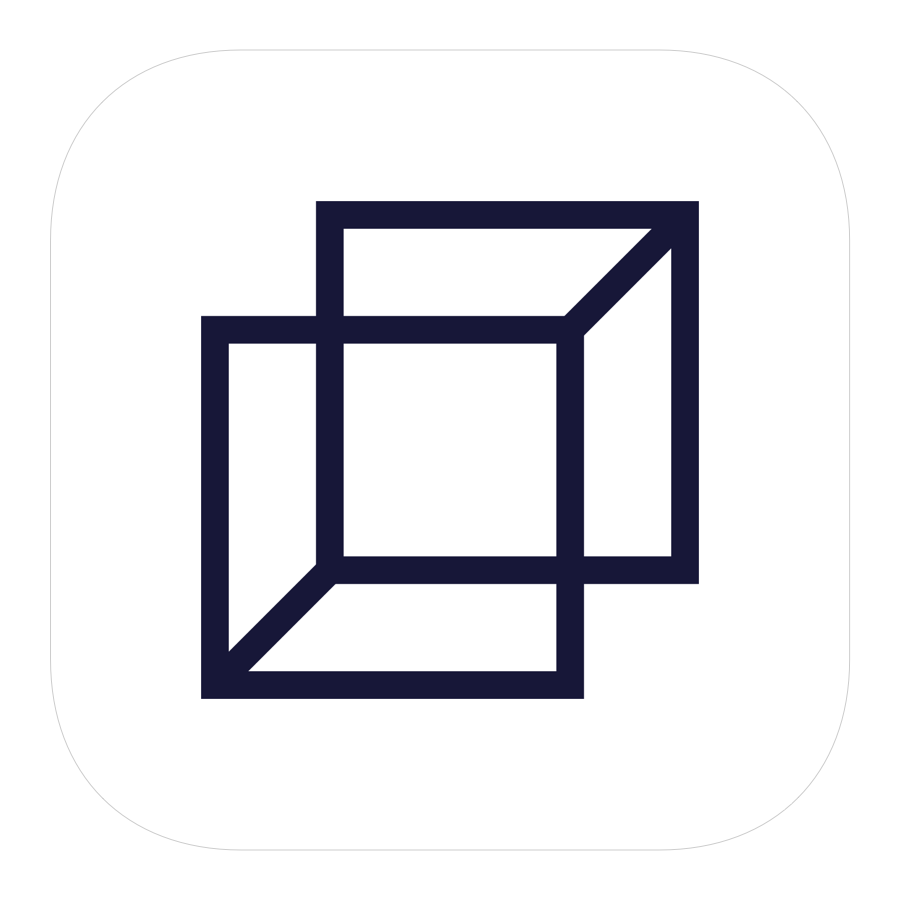
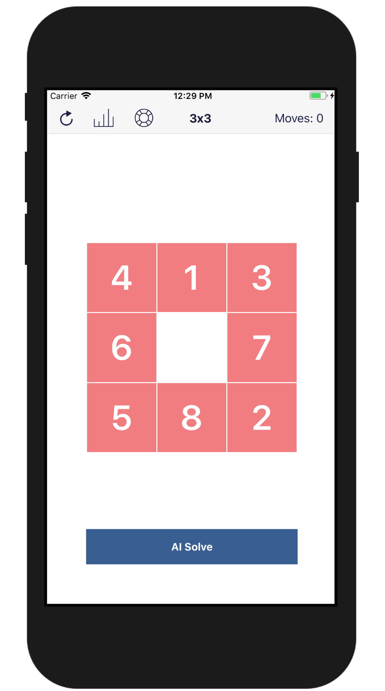

<h3 align="center">
  
</h3>

# Sliding Puzzle

Swift implementation of a classic Sliding Puzzle game. It contains [Iterative Deepening A*](https://en.wikipedia.org/wiki/Iterative_deepening_A*) AI Solver.

# iOS Appstore App

## Author

**Greg (Grzegorz) Surma**

[**PORTFOLIO**](https://gsurma.github.io)

[**GITHUB**](https://github.com/gsurma)

[**BLOG**](https://medium.com/@gsurma)

